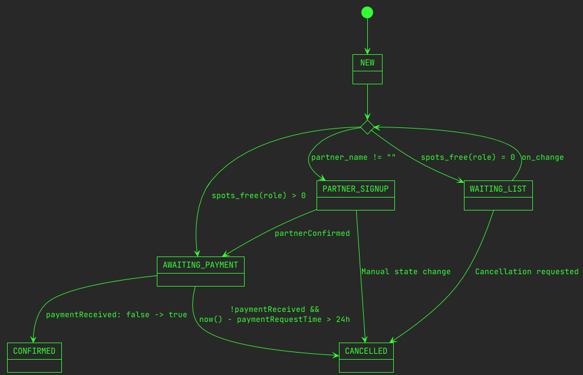

# `wcs-workshop-registration`

A Google Sheets application (yes, really...) for partially automating the process of handling workshop registrations.

## Functionality
- When someone registers, determine whether they get a spot or have to go on a waiting list.
- Immediately send an appropriate acknowledgement email to registrants, letting them know whether they got a spot and how to pay, or that they are on the waiting list.
- Automatically send email updates to the registrants when their status changes, e.g. payment is marked as received, or they've made it past the waiting list.

## Limitations
- Doesn't account for different levels.
  - As a corollary, it doesn't have separate waiting lists for different levels.
- No integration with payment reception -- a human has to go in and check a box when payment is received.
  - Payment notifications have been handled by a combination of asking registrants to send their Vipps transaction receipt by email and getting a list of payments from NTNUI Dance's finance officer.
- Partner registrations require manual processing.
- No update emails are sent about waiting list positions. A periodic update could be nice.
- The data format is tightly coupled to the specifics of the 2022 spring course, and will likely have to be modified to be used for other cases.
- It is unknown whether it works at all if a different user than the one who configured it does something (e.g. registering a payment as received) in the application.

## Setup
To use it, create a Google Form to gather the necessary information about the people registering, create a Google Sheet connected to the Form, and upload the script using Google's `clasp` tool.

The application expects certain sheets to exist.
These have to be created.
See `SheetIds` in `dataAccess.ts` for a list of required sheets.

After that, a trigger has to be installed so that the processing function is run when new registrations arrive and when manual actions are performed in the sheet.

In certain situations the application will send an email notification about required manual interaction.
These notifications are sent to the address defined in `constants.ts`, so that has to be configured.

## Architecture
The application is designed as a state machine.
When a new registration occurs, the data is read from the raw registration data sheet, certain fields are processed, and the processed data is written to an application internal sheet in the `NEW` state.

After this, the application evaluates the which state to move the new registrant to based on the criteria illustrated in the state diagram in figure 1.

Since admitting a new registrant might mean that a person from the waiting list can also be admitted, the application then reevaluates all the existing registrations.
The application keeps reevaluating until the state stabilizes.
(This is not a particularly efficient approach, but seems to work well enough in practice for the amounts of registrations we usually get.)
